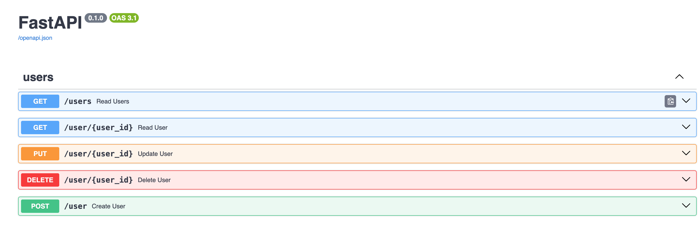
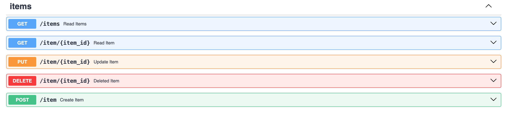
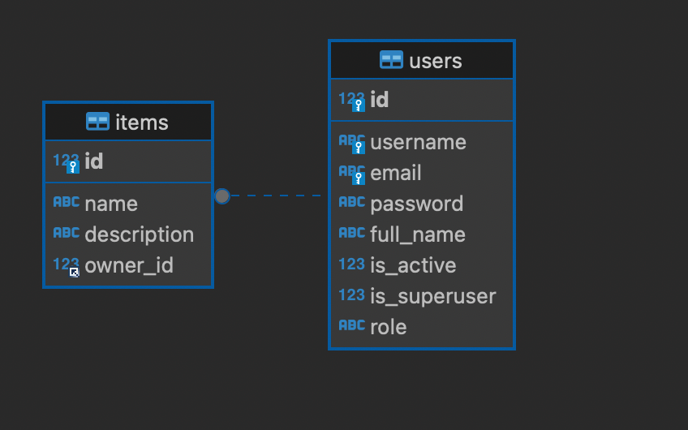

# App Inventory

## Instalación

1. create a virtual env:
```
python3.10 -m venv venv
```

2. Activate the virtual env:
```
source venv/bin/activate
```

3. Run requirements:
```
pip install -r requirements.txt
```

4. for run the app use the next command after install requeriments:

```
uvicorn main:app --reload
```
   
## USERS


## ITEMS


## DER



## Endpoints

### USERS
- `GET /users`: Obtiene una lista de todos los usuarios.
- `GET /user/{user_id}`: Obtiene información detallada sobre un usuario específico.
- `POST /user`: Crea un nuevo usuario.
- `PUT /user/{user_id}`: Actualiza la información de un usuario existente.
- `DELETE /user/{user_id}`: Elimina un usuario existente.

### ITEMS
- `GET /items`: Obtiene una lista de todos los items.
- `GET /item/{item_id}`: Obtiene información detallada sobre un item específico.
- `POST /item`: Crea un nuevo item.
- `PUT /item/{item_id}`: Actualiza la información de un item existente.
- `DELETE /item/{item_id}`: Elimina un item existente.

### CREATE SQL COMMANDS

CREATE DATABASE inventario;

USE inventario;

CREATE TABLE users (
    id INT AUTO_INCREMENT PRIMARY KEY,
    username VARCHAR(50) NOT NULL UNIQUE,
    email VARCHAR(50) NOT NULL UNIQUE,
    password VARCHAR(100) NOT NULL,
    full_name VARCHAR(50) NOT NULL,
    is_active BOOLEAN NOT NULL DEFAULT true,
    is_superuser BOOLEAN NOT NULL DEFAULT false,
    role ENUM('empleado', 'TI') NOT NULL DEFAULT 'empleado'
);

CREATE TABLE items (
    id INT AUTO_INCREMENT PRIMARY KEY,
    name VARCHAR(50) NOT NULL,
    description VARCHAR(100),
    owner_id INT NOT NULL,
    FOREIGN KEY (owner_id) REFERENCES users (id)
);
